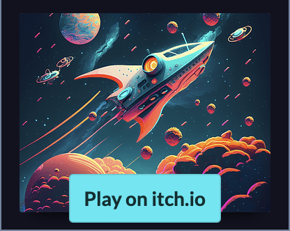

# Star Momentum
   ### Star Momentum is a retro 2D endless runner based on the principle of efficiency, avoid asteroids while moving as little as possible to conserve energy. Pick up blue energy asteroids to increase your energy by 25%. The farther you           go, the higher the score.

   

   ### You have three lives but only one energy bar, if you crash three times or run out of energy it's game over.

   

## Controls
  
  ⬆, W - Move Up

  ⬇, S - Move Down

## Play
   
   

## Requirements

   ### A desktop browser, with mouse and keyboard as Unity in WebGL is not mobile compatible.
